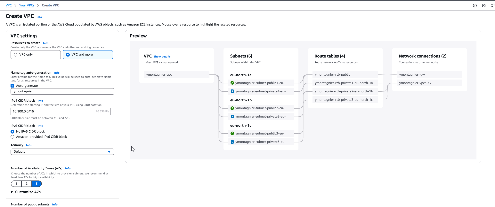
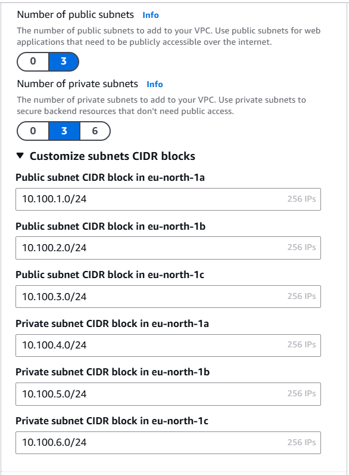
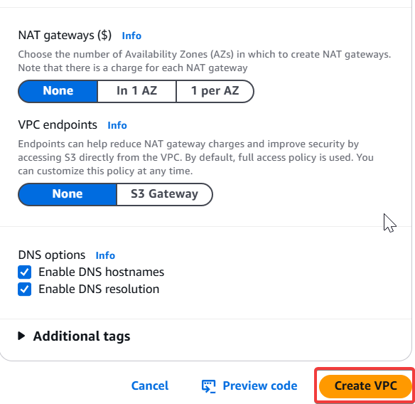
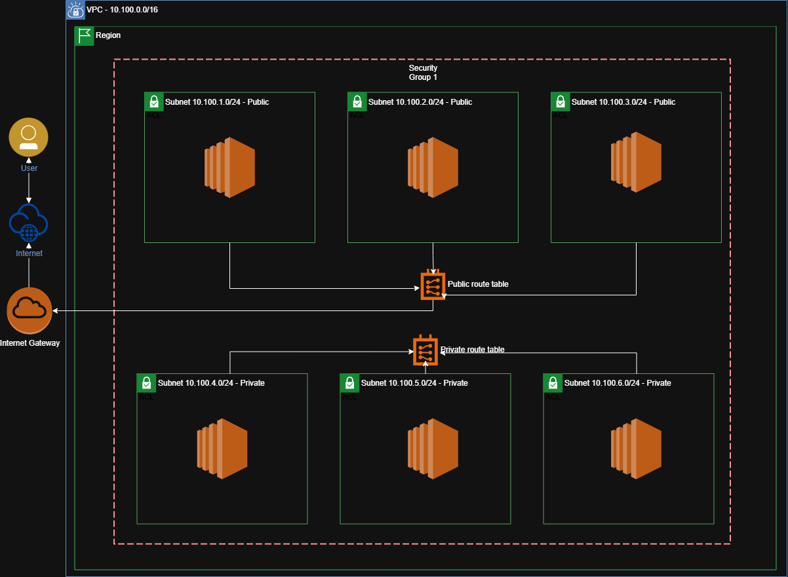

# TP2 - Exercice 1

## 1. Déploiement du VPC
À l'aide de la console AWS, déployer un VPC qui respecte le cahier des charges et contraintes imposées.

 
 

## 2. Récupération des informations
Repérer les informations suivantes sur vos ressources :

VPC :
* ID : `vpc-029c936712b1f1924`
* Nom (tag Name) : `ymontagnier-vpc`
* Plage d'adresses IP : `10.100.0.0/16`

Subnets (pour chaque subnet) : 
| ID du Subnet             | Nom (Tag Name)                          | Plage d'adresses IP | AZ (Availability Zone) | Route Table Associée (Nom)                                   |
| ------------------------ | --------------------------------------- | ------------------- | ---------------------- | ------------------------------------------------------------ |
| subnet-0b22019d56e6f8def | ymontagnier-subnet-public1-eu-north-1a  | 10.100.1.0/24       | eu-north-1a            | rtb-037d2cce4232c89a1 (ymontagnier-rtb-public)               |
| subnet-0ed1739704d8c3909 | ymontagnier-subnet-public2-eu-north-1b  | 10.100.2.0/24       | eu-north-1b            | rtb-037d2cce4232c89a1 (ymontagnier-rtb-public)               |
| subnet-0500370d7efa54f6e | ymontagnier-subnet-public3-eu-north-1c  | 10.100.3.0/24       | eu-north-1c            | rtb-037d2cce4232c89a1 (ymontagnier-rtb-public)               |
| subnet-089d64637a9dd5321 | ymontagnier-subnet-private1-eu-north-1a | 10.100.4.0/24       | eu-north-1a            | rtb-08c62caa590f3e540 (ymontagnier-rtb-private1-eu-north-1a) |
| subnet-04096b094a83a0e59 | ymontagnier-subnet-private2-eu-north-1b | 10.100.5.0/24       | eu-north-1b            | rtb-0aa507498f6911a60 (ymontagnier-rtb-private2-eu-north-1b) |
| subnet-0e779ce17bf9519af | ymontagnier-subnet-private3-eu-north-1c | 10.100.6.0/24       | eu-north-1c            | rtb-05791bdd2ba543c20 (ymontagnier-rtb-private3-eu-north-1c) |

Internet Gateway :
* ID : `igw-0198eb842f09d2469`
* Nom (tag Name) : `ymontagnier-igw`

Route tables (pour chaque route table) :
| Nom de la Route Table                |          ID           | Route1 (local)                                         | Route2 (public) IGW | Subnet associé                                                                |
| ------------------------------------ |:---------------------:| ----------------------------------------------- | ------ |:----------------------------------------------------------------------------- |
| ymontagnier-rtb-default              | rtb-01d00972554ed4697 | Destination : `10.100.0.0/16`, Target : `local`                                                 |        | Route table par défaut (pas d'association explicite à un subnet)              |
| ymontagnier-rtb-public               | rtb-037d2cce4232c89a1 | Destination : `10.100.0.0/16`, Target : `local`                                                | Destination : `0.0.0.0/0`, Target : `igw-0198eb842f09d2469`        | Associée à 3 subnets (publics)                                                |
| ymontagnier-rtb-private1-eu-north-1a | rtb-08c62caa590f3e540 | Destination : `10.100.0.0/16`, Target : `local` |        | Associée à subnet-089d64637a9dd5321 (ymontagnier-subnet-private1-eu-north-1a) |
| ymontagnier-rtb-private2-eu-north-1b | rtb-0aa507498f6911a60 | Destination : `10.100.0.0/16`, Target : `local` |        | Associée à subnet-04096b094a83a0e59 (ymontagnier-subnet-private2-eu-north-1b) |
| ymontagnier-rtb-private3-eu-north-1c | rtb-05791bdd2ba543c20 | Destination : `10.100.0.0/16`, Target : `local` |        | Associée à subnet-0e779ce17bf9519af (ymontagnier-subnet-private3-eu-north-1c) |

Liste de control d'accès par défaut (ACL) : `ymontagnier-acl`
* ID : `acl-0ee24aa0709474b35`
* Nom (tag Name) : `ymontagnier-acl`

Security Group par défaut :
* ID : `sg-0a620dcb5f7a5ea9a`
* Nom (tag Name) : `ymontagnier-sg`

### 3. Tag des ressources non tagguées par défaut
Lors de la création du VPC, certaines ressources sont créées sans tag Owner :

* La route table par défaut
* Les ACL par défaut
* Le Security Group par défaut

Ajouter le tag Owner à ces ressources.

### 4. Création d'un schéma réseau
A l'aide des informations récupérées, créer un schéma de l'architecture réseau déployée.

