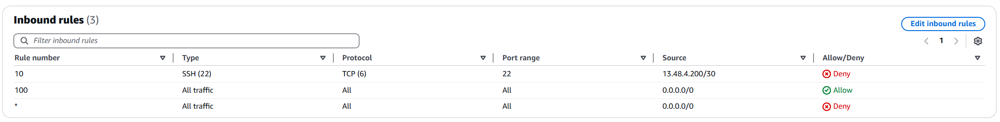

# TP2 - Exercice 2

## 1. Création des instances EC2
Créer les instances EC2 en respectant les contraintes imposées.

> Lors de la création de vos instances EC2 dans l'interface web, certains élément comme la clé SSH ou le security group peuvent être créés au même moment. 
> Cependant, l'interface ne permet pas de rajouter les tags nécessaires. Il faut donc créer ces éléments à l'avance.

## 2. Récupération des informations

Instance EC2 (Bastion)
* ID : `i-08e28e3d12ed8c95a`
* Nom (tag Name) : `ymontagnier-bastion`
* Type : `t3.micro`
* IP publique (si existante) : `13.61.35.100`
* IP privée : `10.100.2.211`
* Subnet associé (nom) : `ymontagnier-subnet-public2-eu-north-1b`
* Security Group associé (nom) : `ymontagnier-sg-bastion`
* Key Pair associé (nom) : `ymontagnier-key-bastion`

Instance EC2 (Nextcloud)
* ID : `i-0dee7f59bba652137`
* Nom (tag Name) : `ymontagnier-nextcloud`
* Type : `t3.micro`
* IP publique (si existante) : N/A
* IP privée : `10.100.4.64`
* Subnet associé (nom) : `ymontagnier-subnet-private1-eu-north-1a`
* Security Group associé (nom) : `ymontagnier-sg-nextcloud`
* Key Pair associé (nom) : `ymontagnier-key-nextcloud`

Security Group (Bastion) :
* ID : `ymontagnier-sg-bastion`
* Nom (tag Name) : `sg-0ec03f92b9f6a2997`
* Règles entrantes : 
J'autorise le SSH depuis mon IP publique.

* Règles sortantes :

Security Group (nextcloud):
* ID : `ymontagnier-sg-nextcloud`
* Nom (tag Name) : `sg-07fde74e5a65a3884`
* Règles entrantes : 
J'autorise le SSH depuis le security-group du bastion.

* Règles sortantes :

Network ACL :
* ID : `acl-0ee24aa0709474b35`
* Nom (tag Name) : `ymontagnier-acl`
* Règles entrantes : 
On bloque le SSH depuis le réseau qu'utilise AWS Instant Connect.

* Règles sortantes :

## Schéma
