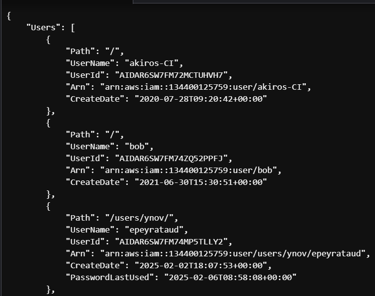

# TP3 - Exercice 1

## 1. Identifier la commande AWS CLI à utiliser
```
aws iam list-users
```


## 2. Filtrer les résultats
```
aws iam list-users --path-prefix /users/ynov/
```
```
{
    "Users": [
        {
            "Path": "/users/ynov/",
            "UserName": "epeyrataud",
            "UserId": "AIDAR6SW7FM74MP5TLLY2",
            "Arn": "arn:aws:iam::134400125759:user/users/ynov/epeyrataud",
            "CreateDate": "2025-02-02T18:07:53+00:00",
            "PasswordLastUsed": "2025-02-06T08:58:08+00:00"
        },
        {
            "Path": "/users/ynov/",
            "UserName": "groux",
            "UserId": "AIDAR6SW7FM7WCAEZ2BEH",
            "Arn": "arn:aws:iam::134400125759:user/users/ynov/groux",
            "CreateDate": "2025-02-02T18:07:52+00:00",
            "PasswordLastUsed": "2025-02-06T08:59:38+00:00"
        },
        {
            "Path": "/users/ynov/",
            "UserName": "gwattel",
            "UserId": "AIDAR6SW7FM7USOUEPXKW",
            "Arn": "arn:aws:iam::134400125759:user/users/ynov/gwattel",
            "CreateDate": "2025-02-02T18:07:52+00:00",
            "PasswordLastUsed": "2025-02-06T08:25:53+00:00"
        },
[...]
```

## 3. Afficher uniquement les noms des utilisateurs

```
users:~/environment $ aws iam list-users --query "Users[?Path=='/users/ynov/'].UserName" --output json --profile formation-infra-cloud                                                                               
[
    "epeyrataud",
    "groux",
    "gwattel",
    "iotamendi",
    "jbats",
    "jpaillusseau",
    "kschaffner",
    "lhusson",
    "mberguella",
    "mlegrand",
    "mtardio",
    "rmarchais",
    "rmartin",
    "sperrin",
    "tcurmi",
    "tfourcade",
    "tquesnoy",
    "ymontagnier"
]

```