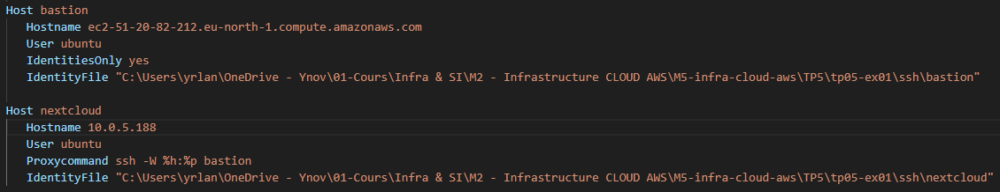

# TP5 - Exercice 1 - EFS/EIP/NAT Gateway

## Contexte
Votre infrastructure vouée à héberger l'application Nextcloud n'est pas encore en production, mais votre direction souhaite déjà valider sa capacité à résister à une panne d'une zone de disponibilité (AZ).

Pour rappel, l'application Nextcloud est une solution open source de stockage et de partage de fichiers qui sera utilisée par l'ensemble des collaborateurs de l'entreprise; certains fichier qui y seront stockés sont critiques et ne doivent pas être perdus.

On vous demande donc de réaliser un POC (Proof of Concept) pour permettre de restaurer rapidement le service dans une autre AZ tout en conservant les données.

Pour cela, on vous demande d'ajouter à votre infrastructure existante un système de fichiers EFS qui permettra de :

* Conserver les données même en cas de perte d'une AZ
* Permettre une reprise rapide sur une autre AZ

Les contraintes sont les suivantes :

* L'infrastructure doit être déployée via Terraform
* Le système de fichiers EFS doit être chiffré au repos
* Le système de fichiers EFS doit être accessible uniquement depuis les sous-réseaux privés
* Seules les instances EC2 attachées au security group "nextcloud" doivent avoir accès au système de fichiers EFS
* Le montage du système de fichiers sur les EC2 nextcloud doit être automatisé via un script de démarrage (user data)

## Objectifs
* Étendre l'infrastructure Terraform existante pour inclure EFS
* Configurer une instance EC2 pour utiliser ce système de fichiers
* Tester la persistance des données en cas de panne d'AZ
* Documenter la procédure de test et ses résultats

## Configuration de l'instance EC2
### Création d'un script user data pour automatiser le montage EFS

> :file_folder: setup_efs.sh
```bash
#!/bin/bash
sudo apt-get update
sudo apt-get install -y nfs-common

# Définition du DNS de l'EFS 
# ${efs_dns} remplace la valeur par celle passée en argument dans le fichier ec2.tf
EFS_DNS="${efs_dns}"

# Création du point de montage
sudo mkdir -p /mnt/efs

# Montage du système de fichiers
sudo mount -t nfs4 -o nfsvers=4.1,rsize=1048576,wsize=1048576,hard,timeo=600,retrans=2,noresvport $EFS_DNS:/ /mnt/efs

# Ajout à fstab pour persistance après redémarrage
echo "$EFS_DNS:/ /mnt/efs nfs4 defaults,_netdev 0 0" | sudo tee -a /etc/fstab
```

### Activation de la résolution DNS sur le VPC
L'EFS sera accessible via une entrée DNS; pour que les instances EC2 puissent résoudre ce DNS il faut activer l'option enable_dns_hostnames sur le VPC.

:file_folder: `vpc.yaml`
```bash
enable_dns_hostnames = true
```

### Création d'un Security Group pour l'EFS
```bash
# Créer un security group pour l'EFS
resource "aws_security_group" "efs_sg" {
  name        = "${local.name}-efs-sg"
  description = "Security group for Nextcloud EFS"
  vpc_id      = aws_vpc.main.id

  tags = {
    Name = "${local.name}-nextcloud-efs-sg"
  }
}
```

### Ajout d'une règle dans le security group
```bash
# Autoriser uniquement Nextcloud à accéder à EFS sur le port 2049
resource "aws_vpc_security_group_ingress_rule" "allow_nfs_from_nextcloud" {
  security_group_id = aws_security_group.efs_sg.id

  referenced_security_group_id = aws_security_group.nextcloud_sg.id
  from_port                    = 2049
  ip_protocol                  = "tcp"
  to_port                      = 2049

  tags = {
    Name = "Allow NFS access from Nextcloud SG"
  }
}
```

### Création d'un système de fichier EFS et des cibles de montage.

On crée le système de fichier en précisant : 
* `creation_token` : Pour créer une token de sécurité.
* `encrypted = true` : Pour activer le chiffrement.
* `performance_mode` : Pour préciser un mode de performance
```bash
resource "aws_efs_file_system" "nextcloud_efs" {
  creation_token   = "nextcloud-efs-token"
  encrypted        = true
  performance_mode = "generalPurpose"
  tags = {
    Name = "${local.name}-EFS-Nextcloud"
  }
}
```
Pour renvoyer le nom DNS du système de fichier EFS lors d'un plan ou apply par exemple :
```bash
output "efs_dns_name" {
  value = aws_efs_file_system.nextcloud_efs.dns_name
}
```
Création des "Mount Target"
```bash
# Créer un mount target pour chaque subnet privé
resource "aws_efs_mount_target" "nextcloud_efs_targets" {
  for_each = { for idx, subnet in aws_subnet.private : idx => subnet.id }

  file_system_id  = aws_efs_file_system.nextcloud_efs.id
  subnet_id       = each.value
  security_groups = [aws_security_group.efs_sg.id]
}
```


### Ajout d'une EIP dans le VPC pour la NAT Gateway
La NAT Gateway
```bash
resource "aws_eip" "nat_eip" {
  domain = "vpc"

  tags = {
    Name = "Public NAT EIP"
  }
}
```

### Ajout d'une NAT Gateway
On crée une seule NAT Gateway dans le subnet public.
```
resource "aws_nat_gateway" "public_nat" {
  allocation_id = aws_eip.nat_eip.id         # Associer l'EIP créée
  subnet_id     = aws_subnet.public[0].id    # Choisir le subnet public
  depends_on    = [aws_internet_gateway.igw] # S'assurer que l'IGW est actif

  tags = {
    Name = "${local.name}-NAT-Gateway"
  }
}
```

On peut également demander à l'instance NextCloud d'attendre que la NAT Gateway soit déployée pour être certain que le script userData soit passé correctement au démarrage (nécessite le réseau) : 
```bash
  depends_on = [aws_nat_gateway.public_nat]
```

### Utiliser la NAT Gateway en route par défaut pour les subnets privés
```bash
resource "aws_route_table" "private" {
  for_each = { for idx, subnet in local.private_subnets_cidrs : idx => subnet }

  vpc_id = aws_vpc.main.id

  route {
    cidr_block     = "0.0.0.0/0"                   # Tout le trafic sortant
    nat_gateway_id = aws_nat_gateway.public_nat.id # Utilise la NAT Gateway
  }

  tags = {
    Name = "${local.name}-private-rtb-${local.azs[each.key]}"
  }
}
```

### Mise à jour de la configuration Terraform de l'instance EC2 pour inclure le script user data

**Explications :**
* `subnet_id` : Changer le `subnet_id` permet de changer l'availability zone dans laquelle se trouvera l'instance NextCloud. Pourra servir à vérifier que les données sont bien disponibles s'il y'a un crash d'une zone.
* `user_data` : L'utilisation de `templatefile` permet de passer un script bash au démarrage de l'instance, utilisant une variable `efs_dns` qui est propre à Terraform.
```bash
resource "aws_instance" "nextcloud" {
  ami                    = "ami-09a9858973b288bdd"
  instance_type          = "t3.micro"
  subnet_id              = aws_subnet.private[1].id # Changer cette ligne pour changer l'AZ
  key_name               = "${local.name}-nextcloud-key"
  vpc_security_group_ids = [aws_security_group.nextcloud_sg.id]
  # user_data              = file("setup_efs.sh")
  user_data = templatefile("setup_efs.sh", {
    efs_dns = aws_efs_file_system.nextcloud_efs.dns_name
  })

  tags = {
    Name = "${local.name}-nextcloud"
  }
}
```

### Logs user-data
> Tips : On peut récupérer les logs du script passé dans le user data sur l'instance NextCloud.
>
> Cela permet de vérifier la sortie du script, nottement le fais que la variable $EFS_DNS soit bien remplacée par la valeur correspondant à l'EFS qui doit être associé à l'instance.
```bash
sudo cat /var/lib/cloud/instance/user-data.txt
#!/bin/bash
sudo apt-get update
sudo apt-get install -y nfs-common

# Définition du DNS de l'EFS 
# fs-0e84015b258fd4c10.efs.eu-north-1.amazonaws.com remplace la valeur par celle passée en argument dans le fichier ec2.tf
EFS_DNS="fs-0e84015b258fd4c10.efs.eu-north-1.amazonaws.com"

# Création du point de montage
sudo mkdir -p /mnt/efs

# Montage du système de fichiers
sudo mount -t nfs4 -o nfsvers=4.1,rsize=1048576,wsize=1048576,hard,timeo=600,retrans=2,noresvport $EFS_DNS:/ /mnt/efs

# Ajout à fstab pour persistance après redémarrage
echo "$EFS_DNS:/ /mnt/efs nfs4 defaults,_netdev 0 0" | sudo tee -a /etc/fstabubuntu@ip-10-0-5-188:~$
```

### Configuration fichier SSH


### Logs cloud-init :
```bash
/var/log/cloud-init.log
/var/log/cloud-init-output.log
```

### Vérifier que le système de fichier EFS est monté
```bash
ubuntu@ip-10-0-5-244:~$ df -h | grep aws
fs-05548ed18b881d2c5.efs.eu-north-1.amazonaws.com:/  8.0E     0  8.0E   0% /mnt/efs
```

## Test de bascule
### Test de création d'un fichier dans le système de fichiers EFS depuis l'instance EC2.
```bash
ubuntu@ip-10-0-5-244:/mnt/efs$ sudo mkdir Dossier1 Dossier2 Dossier3
ubuntu@ip-10-0-5-244:/mnt/efs$ sudo touch Dossier1/test1.txt Dossier2/test2.txt Dossier3/test3.txt
```

### Suppression de l'instance EC2 (simulation de panne d'AZ)
Dans le fichier `ec2.yaml`, je change le `subnet_id` puis je lance un terraform apply pour déployer l'instance Nextcloud dans un autre subnet.
```
resource "aws_instance" "nextcloud" {
  ami                    = "ami-09a9858973b288bdd"
  instance_type          = "t3.micro"
  subnet_id              = aws_subnet.private[0].id # Changer cette ligne pour changer l'AZ
```

### Déploiement d'une nouvelle instance dans une autre AZ
```bash
Terraform will perform the following actions:

  # aws_instance.nextcloud must be replaced
-/+ resource "aws_instance" "nextcloud" {
      ~ arn                                  = "arn:aws:ec2:eu-north-1:134400125759:instance/i-086b32833ddaeb76d" -> (known after apply)
      ~ associate_public_ip_address          = false -> (known after apply)
      ~ availability_zone                    = "eu-north-1b" -> (known after apply)
      ~ cpu_core_count                       = 1 -> (known after apply)
      ~ cpu_threads_per_core                 = 2 -> (known after apply)
      ~ disable_api_stop                     = false -> (known after apply)
      ~ disable_api_termination              = false -> (known after apply)
      ~ ebs_optimized                        = false -> (known after apply)
      + enable_primary_ipv6                  = (known after apply)
      - hibernation                          = false -> null
      + host_id                              = (known after apply)
      + host_resource_group_arn              = (known after apply)
      + iam_instance_profile                 = (known after apply)
      ~ id                                   = "i-086b32833ddaeb76d" -> (known after apply)
      ~ instance_initiated_shutdown_behavior = "stop" -> (known after apply)
      + instance_lifecycle                   = (known after apply)
      ~ instance_state                       = "running" -> (known after apply)
      ~ ipv6_address_count                   = 0 -> (known after apply)
      ~ ipv6_addresses                       = [] -> (known after apply)
      ~ monitoring                           = false -> (known after apply)
      + outpost_arn                          = (known after apply)
      + password_data                        = (known after apply)
      + placement_group                      = (known after apply)
      ~ placement_partition_number           = 0 -> (known after apply)
      ~ primary_network_interface_id         = "eni-05115965f1ea6d3af" -> (known after apply)
      ~ private_dns                          = "ip-10-0-5-244.eu-north-1.compute.internal" -> (known after apply)
      ~ private_ip                           = "10.0.5.244" -> (known after apply)
      + public_dns                           = (known after apply)
      + public_ip                            = (known after apply)
      ~ secondary_private_ips                = [] -> (known after apply)
      ~ security_groups                      = [] -> (known after apply)
      + spot_instance_request_id             = (known after apply)
      ~ subnet_id                            = "subnet-0756457ca468b298f" -> "subnet-0a640ad991ea4362b" # forces replacement
        tags                                 = {
            "Name" = "ymontagnier-tp05-ex01-nextcloud"
        }
      ~ tenancy                              = "default" -> (known after apply)
      + user_data_base64                     = (known after apply)
        # (9 unchanged attributes hidden)

      ~ capacity_reservation_specification (known after apply)
      - capacity_reservation_specification {
          - capacity_reservation_preference = "open" -> null
        }

      ~ cpu_options (known after apply)
      - cpu_options {
          - core_count       = 1 -> null
          - threads_per_core = 2 -> null
            # (1 unchanged attribute hidden)
        }

      - credit_specification {
          - cpu_credits = "unlimited" -> null
        }

      ~ ebs_block_device (known after apply)

      ~ enclave_options (known after apply)
      - enclave_options {
          - enabled = false -> null
        }

      ~ ephemeral_block_device (known after apply)

      ~ instance_market_options (known after apply)

      ~ maintenance_options (known after apply)
      - maintenance_options {
          - auto_recovery = "default" -> null
        }

      ~ metadata_options (known after apply)
      - metadata_options {
          - http_endpoint               = "enabled" -> null
          - http_protocol_ipv6          = "disabled" -> null
          - http_put_response_hop_limit = 2 -> null
          - http_tokens                 = "required" -> null
          - instance_metadata_tags      = "disabled" -> null
        }

      ~ network_interface (known after apply)

      ~ private_dns_name_options (known after apply)
      - private_dns_name_options {
          - enable_resource_name_dns_a_record    = false -> null
          - enable_resource_name_dns_aaaa_record = false -> null
          - hostname_type                        = "ip-name" -> null
        }

      ~ root_block_device (known after apply)
      - root_block_device {
          - delete_on_termination = true -> null
          - device_name           = "/dev/sda1" -> null
          - encrypted             = false -> null
          - iops                  = 3000 -> null
          - tags                  = {
              - "Name"  = "ymontagnier-tp05-ex01"
              - "Owner" = "ymontagnier"
            } -> null
          - tags_all              = {
              - "Name"  = "ymontagnier-tp05-ex01"
              - "Owner" = "ymontagnier"
            } -> null
          - throughput            = 125 -> null
          - volume_id             = "vol-02c37527201a4ea95" -> null
          - volume_size           = 8 -> null
          - volume_type           = "gp3" -> null
            # (1 unchanged attribute hidden)
        }
    }

Plan: 1 to add, 0 to change, 1 to destroy.

Do you want to perform these actions?
  Terraform will perform the actions described above.
  Only 'yes' will be accepted to approve.

  Enter a value: yes
  
aws_instance.nextcloud: Destroying... [id=i-086b32833ddaeb76d]
aws_instance.nextcloud: Still destroying... [id=i-086b32833ddaeb76d, 10s elapsed]
aws_instance.nextcloud: Still destroying... [id=i-086b32833ddaeb76d, 20s elapsed]
aws_instance.nextcloud: Still destroying... [id=i-086b32833ddaeb76d, 30s elapsed]
aws_instance.nextcloud: Still destroying... [id=i-086b32833ddaeb76d, 40s elapsed]
aws_instance.nextcloud: Destruction complete after 41s
aws_instance.nextcloud: Creating...
aws_instance.nextcloud: Still creating... [10s elapsed]
aws_instance.nextcloud: Creation complete after 13s [id=i-0bed10fc5d10719dc]

Apply complete! Resources: 1 added, 0 changed, 1 destroyed.

Outputs:

efs_dns_name = "fs-05548ed18b881d2c5.efs.eu-north-1.amazonaws.com"
```

### Vérification de l'accès aux données précédemment créées
```bash
PS C:\Users\yrlan\OneDrive - Ynov\01-Cours\Infra & SI\M2 - Infrastructure CLOUD AWS\M5-infra-cloud-aws\TP5\tp05-ex01> ssh nextcloud
The authenticity of host '10.0.4.249 (<no hostip for proxy command>)' can't be established.
ED25519 key fingerprint is SHA256:O5pLkeYczPP7Rg3i25Y1ut93QUGwpG2cgw6FDAL+ALM.
This key is not known by any other names.
Are you sure you want to continue connecting (yes/no/[fingerprint])? yes
Warning: Permanently added '10.0.4.249' (ED25519) to the list of known hosts.

ubuntu@ip-10-0-4-249:~$ df -h
Filesystem                                           Size  Used Avail Use% Mounted on
/dev/root                                            6.8G  1.9G  4.8G  29% /
tmpfs                                                458M     0  458M   0% /dev/shm
tmpfs                                                183M  908K  182M   1% /run
tmpfs                                                5.0M     0  5.0M   0% /run/lock
efivarfs                                             128K  3.6K  120K   3% /sys/firmware/efi/efivars
/dev/nvme0n1p16                                      881M   76M  744M  10% /boot
/dev/nvme0n1p15                                      105M  6.1M   99M   6% /boot/efi
fs-05548ed18b881d2c5.efs.eu-north-1.amazonaws.com:/  8.0E     0  8.0E   0% /mnt/efs
tmpfs                                                 92M   12K   92M   1% /run/user/1000
ubuntu@ip-10-0-4-249:~$ ls -l /mnt/efs/*
/mnt/efs/Dossier1:
total 4
-rw-r--r-- 1 root root 0 Feb 24 09:56 test1.txt

/mnt/efs/Dossier2:
total 4
-rw-r--r-- 1 root root 0 Feb 24 09:56 test2.txt

/mnt/efs/Dossier3:
total 4
-rw-r--r-- 1 root root 0 Feb 24 09:56 test3.txt
```