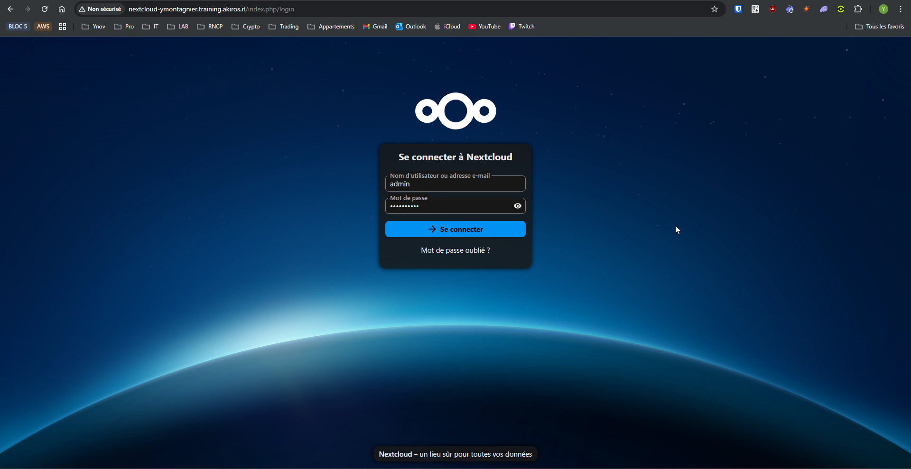
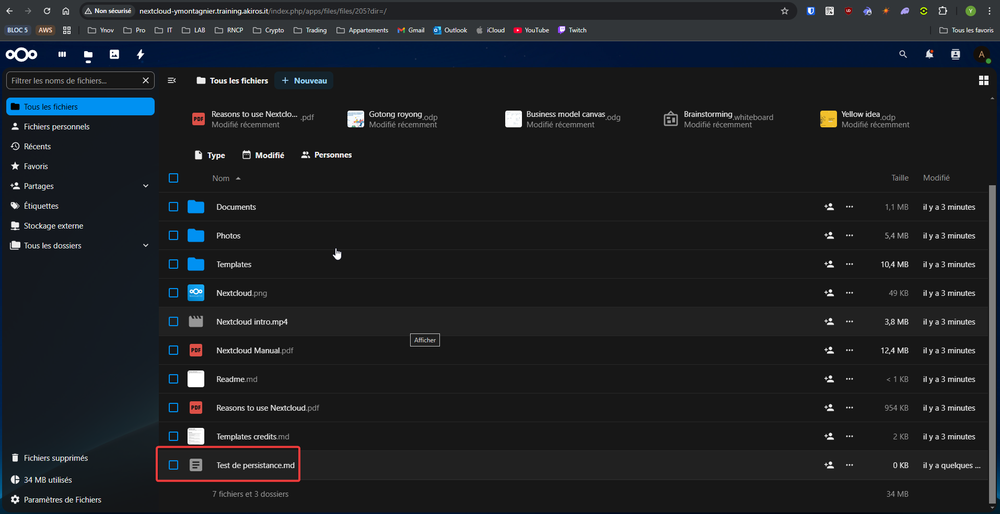
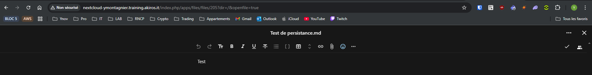

# TP7-EX01 - Déploiement de l'application Nextcloud

## Contexte
L'infrastructure pour héberger le service Nextcloud a été préparée et testée, cependant, l'application n'est pas encore installée sur l'instance EC2.

De plus, en l'état, une fois installée, l'application ne sera pas accessible depuis internet puisque l'instance EC2 est dans un sous-réseau privé.

La volonté initiale de votre direction était de permettre l'accès à l'application uniquement via un VPN, mais suite à des contraintes de temps et de ressources, il a été décidé de simplifier l'accès à l'application en la rendant accessible depuis internet dans un premier temps.

On vous demande de travailler conjointement avec l'équipe DevOps qui sera en charge de vous aider à automatiser l'installation de Nextcloud sur les instances EC2.

Vous devrez donc déployer l'application et la rendre accessible depuis internet, tout en respectant les contraintes suivantes :

* L'instance EC2 doit rester dans le sous-réseau privé
* L'application doit être accessible via un FQDN appartenant au sous-domaine training.akiros.it de l'entreprise.
* L'accès à l'application doit être restreint aux adresses IP de l'entreprise
* La solution architecturale doit anticiper la scalabilité et la haute disponibilité de l'application

## Objectifs
* Déployer l'application Nextcloud sur l'instance EC2
* Configurer un Application Load Balancer pour permettre l'accès à l'application depuis internet
* Créer un enregistrement DNS pour l'application dans le sous-domaine training.akiros.it.
* Restreindre l'accès à l'application aux adresses IP de l'entreprise
* Tester l'accès à l'application depuis internet
* Tester la persistance des données en cas de panne d'AZ

---

## Plan de mise en œuvre

### 1. Déploiement de l'application Nextcloud via script `user_data`
- Utiliser le script userdata fourni par l'équipe DevOPS pour installer Nextcloud sur l'instance EC2.
- Configuration du **montage EFS** pour assurer la persistance des données.
- Vérification du bon fonctionnement de l’application via l’ALB.

:file_folder: `userdata/nextcloud.sh.tftpl`

```bash
#!/bin/bash -x

export DEBIAN_FRONTEND=noninteractive

# Update the package repository
sudo apt-get update

# Install necessary packages
sudo apt-get install -y \
    apache2 \
    awscli \
    libapache2-mod-php \
    mysql-client \
    nfs-common \
    php \
    php-cli \
    php-common \
    php-curl \
    php-fpm \
    php-gd \
    php-imap \
    php-mbstring \
    php-mysql \
    php-redis \
    php-xml \
    php-zip \
    unzip

# Create the mount point for the EFS file system
sudo mkdir -p /mnt/efs

# Mount the EFS file system
sudo mount -t nfs4 -o nfsvers=4.1,rsize=1048576,wsize=1048576,hard,timeo=600,retrans=2,noresvport ${efs_dns}:/ /mnt/efs

# Add the EFS mount to /etc/fstab to mount it automatically at boot
echo '${efs_dns}:/ /mnt/efs nfs4 nfsvers=4.1,rsize=1048576,wsize=1048576,hard,timeo=600,retrans=2,noresvport,_netdev 0 0' | sudo tee -a /etc/fstab

# Create the directory for the Nextcloud installation
sudo mkdir -p /data/www/

# Download and extract the latest Nextcloud release
cd /tmp &&
    sudo wget -q https://download.nextcloud.com/server/releases/latest.zip &&
    sudo unzip -q -d /data/www/ latest.zip

# Create the data directory for Nextcloud
sudo mkdir -p /data/www/nextcloud/data

# Set the correct permissions
sudo chown -R www-data:www-data /data/www/
cd /data/www/nextcloud/

# Check if the nextcloud directory exists on the EFS
if [ ! -d /mnt/efs/nextcloud ]; then
    # Create the directory structure on the EFS
    sudo mkdir -p /mnt/efs/nextcloud/data
    sudo mkdir -p /mnt/efs/nextcloud/config

    sudo chown -R www-data:www-data /mnt/efs/nextcloud

    # Move the config directory to the EFS
    sudo rsync -azr /data/www/nextcloud/config/ /mnt/efs/nextcloud/config/ --remove-source-files

    # Mount the EFS directories to the correct locations
    sudo mount --bind /mnt/efs/nextcloud/config /data/www/nextcloud/config
    sudo mount --bind /mnt/efs/nextcloud/data /data/www/nextcloud/data

    set +x # Avoid printing password in logs

    # Install Nextcloud
    sudo -u www-data php occ maintenance:install \
        --database='mysql' \
        --database-name='${db_name}' \
        --database-host='${db_host}' \
        --database-user='${db_user}' \
        --database-pass='${db_pass}' \
        --admin-pass='N3xtcl0ud!'

    set -x # Set xtrace back

    # Set the trusted domains
    sudo -u www-data php occ config:system:set trusted_domains 1 \
        --value="${fqdn}"

    # Enable Files External app
    sudo -u www-data php occ app:enable files_external

else
    mount --bind /mnt/efs/nextcloud/config /data/www/nextcloud/config
    mount --bind /mnt/efs/nextcloud/data /data/www/nextcloud/data
fi

echo '/mnt/efs/nextcloud/config /data/www/nextcloud/config none _netdev,noatime,bind,defaults 0 0' | sudo tee -a /etc/fstab
echo '/mnt/efs/nextcloud/data /data/www/nextcloud/data none _netdev,noatime,bind,defaults 0 0' | sudo tee -a /etc/fstab

# Configure Apache
sudo sed -i 's/AllowOverride None/AllowOverride All/g' /etc/apache2/apache2.conf

cat >/etc/apache2/sites-available/nextcloud.conf <<EOF
<VirtualHost *:80>
    ServerName ${fqdn}
    DocumentRoot /data/www/nextcloud
    <Directory /data/www/nextcloud>
        Require all granted
        Options FollowSymlinks MultiViews
        AllowOverride All
        <IfModule mod_dav.c>
            Dav off
        </IfModule>
    </Directory>

    ErrorLog /var/log/apache2/nextcloud.error_log
    CustomLog /var/log/apache2/nextcloud.access_log common
</VirtualHost>
<VirtualHost *:443>
    ServerName ${fqdn}
    DocumentRoot /data/www/nextcloud
    <Directory /data/www/nextcloud>
        Require all granted
        AllowOverride All
        Options FollowSymLinks MultiViews

        <IfModule mod_dav.c>
            Dav off
        </IfModule>
    </Directory>
</VirtualHost>
EOF
sudo a2ensite nextcloud.conf
sudo a2enmod rewrite
sudo systemctl restart apache2
```


#### Génération des valeurs `user_data` pour l'instance NextCloud
* `fqdn`    = `aws_route53_record.nextcloud.fqdn`

:file_folder: `locals.tf`
```bash
# Generate the user data for the Nextcloud instance
locals {
  nextcloud_userdata = templatefile("${path.module}/userdata/nextcloud.sh.tftpl",
    {
      efs_dns = aws_efs_file_system.nextcloud.dns_name,
      db_name = aws_db_instance.nextcloud.db_name,
      db_host = aws_db_instance.nextcloud.address,
      db_user = aws_db_instance.nextcloud.username,
      db_pass = random_password.rds_nextcloud.result,
      fqdn    = aws_route53_record.nextcloud.fqdn,
  })
}
```

### Adaptation de la valeur `user_data` pour l'instance NextCloud
:file_folder: `ec2.tf`
```bash
# Définition de la ressource aws_instance nextcloud
resource "aws_instance" "nextcloud" {
  ami                    = "ami-09a9858973b288bdd"
  instance_type          = "t3.micro"
  subnet_id              = aws_subnet.private["a"].id           # Changer cette ligne pour changer l'AZ
  key_name               = aws_key_pair.nextcloud.key_name      # Utiliser la paire de clés nextcloud
  vpc_security_group_ids = [aws_security_group.nextcloud_sg.id] # Utiliser le groupe de sécurité nextcloud_sg
  user_data              = local.nextcloud_userdata             # Utiliser le script de démarrage généré dans locals.tf

  # user_data = templatefile("setup_efs.sh", {             # Utiliser un script de démarrage pour monter le système de fichiers EFS
  #   efs_dns = aws_efs_file_system.nextcloud_efs.dns_name # Passer le nom DNS du système de fichiers EFS au script de démarrage
  # })

  depends_on = [aws_nat_gateway.public_nat, aws_route_table_association.private] # Attendre que la gateway NAT et la route vers internet soient créées

  tags = {
    Name = "${local.name}-nextcloud"
  }
}
```

### 2. Mise en place d’un Application Load Balancer (ALB)
* Définir les ressources Terraform nécessaires pour déployer un Application Load Balancer.
* Création de l’**ALB** dans les sous-réseaux publics.

:file_folder: `alb.tf`
```bash
# Création de l'ALB
resource "aws_lb" "nextcloud" {
  name               = "ymontagnier-nextcloud-alb"
  internal           = false
  load_balancer_type = "application"
  security_groups    = [aws_security_group.alb.id]
  subnets            = [for s in aws_subnet.public : s.id] # Liste des sous-réseaux publics

  tags = {
    Name = "${local.name}-nextcloud-alb"
  }
}

output "alb_dns_name" {
  value = aws_lb.nextcloud.dns_name
}
```

### 3. Configuration du groupe cible (target group)
- Définition d’un **groupe cible (Target Group)** pour l'instance Nextcloud existante.
- Mise en place des **health checks** pour garantir la disponibilité.

:file_folder: `alb.tf`

```bash
# Création du groupe cible pour Nextcloud
resource "aws_lb_target_group" "nextcloud" {
  name     = "ymontagnier-nextcloud-alb-tg"
  port     = 80
  protocol = "HTTP"
  vpc_id   = aws_vpc.main.id

  health_check {
    path                = "/status.php"
    interval            = 30
    timeout             = 5
    healthy_threshold   = 3
    unhealthy_threshold = 3
  }

    tags = {
    Name = "${local.name}-nextcloud-alb-tg"
  }
}
```

- Rattacher l'instance EC2 à ce target group
```bash
# Attachement de l'instance EC2 au groupe cible
resource "aws_lb_target_group_attachment" "nextcloud" {
  target_group_arn = aws_lb_target_group.nextcloud.arn
  target_id        = aws_instance.nextcloud.id
  port             = 80
}
```


### 4. Configuration des listeners et du routage
- Ajout d’un **listener HTTP** sur l’ALB.
- Redirection du trafic vers le **groupe cible (target group) contenant Nextcloud**.

:file_folder: `alb.tf`
```bash
# Configuration du listener HTTP (redirection vers HTTPS)
resource "aws_lb_listener" "http" {
  load_balancer_arn = aws_lb.nextcloud.arn
  port              = 80
  protocol          = "HTTP"

  # Redirection vers HTTP
  default_action {
    type = "forward"
    target_group_arn = aws_lb_target_group.nextcloud.arn
  }

  # Tags
  tags = {
    Name = "${local.name}-nextcloud-alb-http-listener"
  }
}
```

- Mise à jour des **groupes de sécurité** pour restreindre l’accès aux **IP de l’entreprise**.
:file_folder: `security-groups.tf`
```bash
# Groupe de sécurité pour l'ALB
resource "aws_security_group" "alb" {
  name   = "nextcloud-alb-sg"
  vpc_id = aws_vpc.main.id

  # Autoriser HTTP/HTTPS depuis les IP de l'entreprise
  ingress {
    from_port   = 80
    to_port     = 80
    protocol    = "tcp"
    cidr_blocks = ["0.0.0.0/0"] # Remplace par l'IP de ton entreprise
  }

  ingress {
    from_port   = 443
    to_port     = 443
    protocol    = "tcp"
    cidr_blocks = ["0.0.0.0/0"]
  }

  # Autoriser tout le trafic sortant
  egress {
    from_port   = 0
    to_port     = 0
    protocol    = "-1"
    cidr_blocks = ["0.0.0.0/0"]
  }
}
```

### 5. Ajout de l’enregistrement DNS
- Création d’un **enregistrement Route 53** sous `training.akiros.it` pointant vers l’ALB.
- Vérification de la **résolution DNS** et de l’accessibilité via un navigateur.
- `fqdn`    = `aws_route53_record.nextcloud.fqdn`

:file_folder: `route53.tf`
```bash
# Get the Route53 zone ID for the training subdomain
data "aws_route53_zone" "training" {
  name = "training.akiros.it"
}

# Create a Route53 record for the ALB
resource "aws_route53_record" "nextcloud" {
  zone_id = data.aws_route53_zone.training.zone_id
  name    = "nextcloud-${local.user}"
  type    = "A"
  alias {
    name                   = aws_lb.nextcloud.dns_name
    zone_id                = aws_lb.nextcloud.zone_id
    evaluate_target_health = true
  }
}
```

### 6. Test de l'accès à l'application
* Récupérer le FQDN précédemment créé dans le sous domaine training.akiros.it.
```
output "alb_dns_name" {
  value = aws_lb.nextcloud.dns_name
}
```
Directement depuis la VM NextCloud :
```
ubuntu@ip-10-0-4-235:~$ cat /etc/apache2/sites-available/nextcloud.conf | grep -i Servername
    ServerName nextcloud-ymontagnier.training.akiros.it
    ServerName nextcloud-ymontagnier.training.akiros.it
```

* Tester l'accès à l'application depuis un navigateur web.


### 7. Test de la persistance des données
* S'Authentifier sur l'application Nextcloud
* Créer un fichier sur l'application


* Simuler une panne d'AZ (redéployer l'instance EC2 dans une autre AZ)
```
PS C:\Users\yrlan\OneDrive - Ynov\01-Cours\Infra & SI\M2 - Infrastructure CLOUD AWS\M5-infra-cloud-aws\TP7\TP07-EX01> terraform apply -replace aws_instance.nextcloud
```

Dans le fichier d'instance EC2, je change la zone de dispo de l'instance avec : 
-  `subnet_id`           = `aws_subnet.private["b"].id`         (Changer cette ligne pour changer l'AZ)
```
# Définition de la ressource aws_instance nextcloud
resource "aws_instance" "nextcloud" {
  ami                    = "ami-09a9858973b288bdd"
  instance_type          = "t3.micro"
  subnet_id              = aws_subnet.private["b"].id           # Changer cette ligne pour changer l'AZ
  key_name               = aws_key_pair.nextcloud.key_name      # Utiliser la paire de clés nextcloud
  vpc_security_group_ids = [aws_security_group.nextcloud_sg.id] # Utiliser le groupe de sécurité nextcloud_sg
  user_data              = local.nextcloud_userdata             # Utiliser le script de démarrage généré dans locals.tf

  # user_data = templatefile("setup_efs.sh", {             # Utiliser un script de démarrage pour monter le système de fichiers EFS
  #   efs_dns = aws_efs_file_system.nextcloud_efs.dns_name # Passer le nom DNS du système de fichiers EFS au script de démarrage
  # })

  depends_on = [aws_nat_gateway.public_nat, aws_route_table_association.private] # Attendre que la gateway NAT et la route vers internet soient créées

  tags = {
    Name = "${local.name}-nextcloud"
  }
}
```

* Vérifier que le fichier créé est toujours présent

Après reboot, on vois que le fichier est toujours présent


---

## Livrables
- Code **Terraform** incluant la configuration ALB et le déploiement Nextcloud.
- **Capture d’écran** montrant l’accès réussi à l’application via l’ALB.
- **Schéma d’architecture** mis à jour avec l’infrastructure actuelle.

## Critères de validation
- Nextcloud est **accessible via l’ALB et un FQDN** (`training.akiros.it`).
- L’accès est **restreint aux adresses IP de l’entreprise**.
- Le **schéma d’architecture** est clair et à jour.
