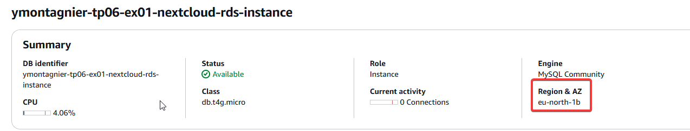
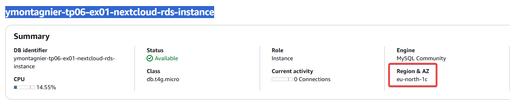

# POC : Migration vers une base de données managée (Amazon RDS)

## 🎯 Contexte

Dans la configuration actuelle de votre infrastructure Nextcloud, la gestion de la base de données n'a pas été abordée et votre travail précédent sur EFS a mis en évidence la nécessité de disposer d'une solution de stockage de données fiable, performante et pouvant prendre en charge l'indisponibilité d'une zone de disponibilité.

En préparation de la mise en production, votre direction souhaite valider la possibilité d'utiliser Amazon RDS pour gérer la base de données.

On vous demande donc de réaliser un second POC pour :
* Déployer une instance RDS MySQL compatible avec Nextcloud
* Valider les aspects de sécurité et de connectivité
* Tester la haute disponibilité de la base de données

## 🔧 Contraintes

- Déploiement via Terraform
- L'instance RDS doit être déployée dans les sous-réseaux privés
- L'instance RDS doit être accessible uniquement depuis les instances EC2 Nextcloud
- L'instance RDS doit être configurée pour pouvoir supporter un failover sur une autre zone de disponibilité

Comme il s'agit d'un POC on vous demandera de configurer une instance RDS de petite taille (`db.t4g.micro`) et de ne pas vous soucier de la gestion des backups, des logs, ou autres paramètres avancés.

## 📌 Objectifs

- Étendre l'infrastructure Terraform pour inclure Amazon RDS.
- Configurer une instance RDS MySQL compatible avec Nextcloud et qui respecte les contraintes imposées.
- Restreindre l'accès uniquement aux instances EC2 Nextcloud.
- Tester la haute disponibilité en simulant une panne d'AZ et vérifier le comportement.


---

## 🛠 Étapes de réalisation

### 1️⃣ Extension de l'infrastructure Terraform

#### Documentations
Liste des pages de documentation Terraform qui pourraient vous être utiles :
* [DB Subnet Group](https://registry.terraform.io/providers/hashicorp/aws/latest/docs/resources/db_subnet_group)
* [RDS Instance](https://registry.terraform.io/providers/hashicorp/aws/latest/docs/resources/db_instance)

#### 📌 Analyse de compatibilité

Nextcloud est compatible avec MySQL 5.7+ et MariaDB 10+. RDS MySQL répond donc aux exigences.

> Pour ce POC on ne se souciera pas, pour le moment, de la gestion des users, passwords et autres secrets.

#### 🏗 Ajout d'une ressource RDS

Création d'un fichier `rds.tf` avec :

```hcl
resource "aws_db_instance" "nextcloud_db" {
  identifier             = "nextcloud-rds"
  engine                = "mysql"
  engine_version        = "8.0"
  instance_class        = "db.t4g.micro"
  allocated_storage     = 20
  storage_type          = "gp2"
  username             = "admin"
  password             = "Password123!"
  db_subnet_group_name  = aws_db_subnet_group.nextcloud_rds_subnet.id
  vpc_security_group_ids = [aws_security_group.nextcloud_db_sg.id]
  multi_az             = true
  publicly_accessible  = false
  skip_final_snapshot  = true
  tags = {
    Name = "nextcloud-rds"
  }
}
```

#### 🌐 Création du groupe de sous-réseaux privés pour les RDS

```hcl
resource "aws_db_subnet_group" "nextcloud_rds_subnet" {
  name       = "nextcloud-rds-subnet"
  subnet_ids = [aws_subnet.private[0].id, aws_subnet.private[1].id, aws_subnet.private[2].id]
}
```

#### 🔐 Sécurisation avec un Security Group

```hcl
resource "aws_security_group" "nextcloud_db_sg" {
  name        = "nextcloud-db-sg"
  description = "Contrôle l'accès à RDS Nextcloud"
  vpc_id      = aws_vpc.main.id

  ingress {
    from_port   = 3306
    to_port     = 3306
    protocol    = "tcp"
    security_groups = [aws_security_group.nextcloud_sg.id]
  }

  egress {
    from_port   = 0
    to_port     = 0
    protocol    = "-1"
    cidr_blocks = ["0.0.0.0/0"]
  }
}
```

---

### 2️⃣ Test de connectivité

#### 🚀 Installation du client MySQL

Sur l'instance EC2 Nextcloud :

```sh
sudo apt update && sudo apt install -y mysql-client
```

Vérification :
```sh
mysql --version
```
#### 🔌 Connexion à la base de données

```bash
ubuntu@ip-10-0-6-99:/efs-utils$ mysql -h ymontagnier-tp06-ex01-nextcloud-rds-instance.c2oopr9eothp.eu-north-1.rds.amazonaws.com  -u admin -p
Enter password:
Welcome to the MySQL monitor.  Commands end with ; or \g.
Your MySQL connection id is 32
Server version: 8.0.40 Source distribution

Copyright (c) 2000, 2025, Oracle and/or its affiliates.

Oracle is a registered trademark of Oracle Corporation and/or its
affiliates. Other names may be trademarks of their respective
owners.

Type 'help;' or '\h' for help. Type '\c' to clear the current input statement.
```

#### 📝 Test de création/lecture de données

Une fois connecté :
```sql
mysql> CREATE DATABASE nextcloud;
Query OK, 1 row affected (0.01 sec)

mysql> use nextcloud
Database changed
mysql> CREATE TABLE test (id INT PRIMARY KEY, name VARCHAR(50));
 test VALUES (1, 'Nextcloud');

SELECT * FROMQuery OK, 0 rows affected (0.07 sec)

mysql> INSERT INTO test VALUES (1, 'Nextcloud');
 test;Query OK, 1 row affected (0.00 sec)

mysql>
mysql> SELECT * FROM test;
+----+-----------+
| id | name      |
+----+-----------+
|  1 | Nextcloud |
+----+-----------+
1 row in set (0.00 sec)
```

---

### 3️⃣ Test de haute disponibilité

#### 🛑 Déclenchement d'un failover

Depuis AWS CLI :
On force un redémarrage avec failover (`--force-failover`) :  
```sh
PS C:\Users\yrlan\OneDrive - Ynov\01-Cours\Infra & SI\M2 - Infrastructure CLOUD AWS\M5-infra-cloud-aws\TP6\tp06-ex01> aws rds reboot-db-instance --db-instance-identifier ymontagnier-tp06-ex01-nextcloud-rds-instance --force-failover
{
    "DBInstance": {
        "DBInstanceIdentifier": "ymontagnier-tp06-ex01-nextcloud-rds-instance",
        "DBInstanceClass": "db.t4g.micro",
        "Engine": "mysql",
        "DBInstanceStatus": "rebooting",
        "MasterUsername": "admin",
        "Endpoint": {
            "Address": "ymontagnier-tp06-ex01-nextcloud-rds-instance.c2oopr9eothp.eu-north-1.rds.amazonaws.com",
            "Port": 3306,
            "HostedZoneId": "Z3MPDEQW7KHUGY"
        },
        "AllocatedStorage": 10,
        "InstanceCreateTime": "2025-02-24T14:38:13.974000+00:00",
        "PreferredBackupWindow": "00:04-00:34",
        "BackupRetentionPeriod": 0,
        "DBSecurityGroups": [],
        "VpcSecurityGroups": [
            {
                "VpcSecurityGroupId": "sg-014b6f9ce39b42427",
                "Status": "active"
            }
        ],
        "DBParameterGroups": [
            {
                "DBParameterGroupName": "default.mysql8.0",
                "ParameterApplyStatus": "in-sync"
            }
        ],
        "AvailabilityZone": "eu-north-1c",
        "DBSubnetGroup": {
            "DBSubnetGroupName": "ymontagnier-tp06-ex01-nextcloud-rds-subnet",
            "DBSubnetGroupDescription": "Managed by Terraform",
            "VpcId": "vpc-03dadc02db23ce24b",
            "SubnetGroupStatus": "Complete",
            "Subnets": [
                {
                    "SubnetIdentifier": "subnet-0d843dc45f803f854",
                    "SubnetAvailabilityZone": {
                        "Name": "eu-north-1b"
                    },
                    "SubnetOutpost": {},
                    "SubnetStatus": "Active"
                },
                {
                    "SubnetIdentifier": "subnet-0fabf02f41f2f7211",
                    "SubnetAvailabilityZone": {
                        "Name": "eu-north-1a"
                    },
                    "SubnetOutpost": {},
                    "SubnetStatus": "Active"
                },
                {
                    "SubnetIdentifier": "subnet-08dab066efbe7e7cb",
                    "SubnetAvailabilityZone": {
                        "Name": "eu-north-1c"
                    },
                    "SubnetOutpost": {},
                    "SubnetStatus": "Active"
                }
            ]
        },
        "PreferredMaintenanceWindow": "sat:00:59-sat:01:29",
        "PendingModifiedValues": {},
        "MultiAZ": true,
        "EngineVersion": "8.0.40",
        "AutoMinorVersionUpgrade": true,
        "ReadReplicaDBInstanceIdentifiers": [],
        "LicenseModel": "general-public-license",
        "OptionGroupMemberships": [
            {
                "OptionGroupName": "default:mysql-8-0",
                "Status": "in-sync"
            }
        ],
        "SecondaryAvailabilityZone": "eu-north-1b",
        "PubliclyAccessible": false,
        "StorageType": "gp2",
        "DbInstancePort": 0,
        "StorageEncrypted": false,
        "DbiResourceId": "db-SMWUJQX3U4B3WIPW3CLLX7XXMY",
        "CACertificateIdentifier": "rds-ca-rsa2048-g1",
        "DomainMemberships": [],
        "CopyTagsToSnapshot": false,
        "MonitoringInterval": 0,
        "DBInstanceArn": "arn:aws:rds:eu-north-1:134400125759:db:ymontagnier-tp06-ex01-nextcloud-rds-instance",
        "IAMDatabaseAuthenticationEnabled": false,
        "DatabaseInsightsMode": "standard",
        "PerformanceInsightsEnabled": false,
        "DeletionProtection": false,
        "AssociatedRoles": [],
        "TagList": [
            {
                "Key": "Owner",
                "Value": "ymontagnier"
            },
            {
                "Key": "Name",
                "Value": "ymontagnier-tp06-ex01-nextcloud-rds-instance"
            }
        ],
        "CustomerOwnedIpEnabled": false,
        "BackupTarget": "region",
        "NetworkType": "IPV4",
        "StorageThroughput": 0,
        "CertificateDetails": {
            "CAIdentifier": "rds-ca-rsa2048-g1",
            "ValidTill": "2026-02-24T14:37:23+00:00"
        },
        "DedicatedLogVolume": false,
        "EngineLifecycleSupport": "open-source-rds-extended-support"
    }
}
```

Suivi du statut :  
```bash
PS C:\Users\yrlan\OneDrive - Ynov\01-Cours\Infra & SI\M2 - Infrastructure CLOUD AWS\M5-infra-cloud-aws\TP6\tp06-ex01> aws rds describe-db-instances --db-instance-identifier ymontagnier-tp06-ex01-nextcloud-rds-instance --query "DBInstances[*].DBInstanceStatus"
[
    "rebooting"
]
```

#### 🕵️ Observation du comportement
Pendant le failover, tester une requête :  
```bash
ubuntu@ip-10-0-6-99:~$ mysql -h ymontagnier-tp06-ex01-nextcloud-rds-instance.c2oopr9eothp.eu-north-1.rds.amazonaws.com -u admin -p -e "SELECT * FROM nextcloud.test;"
Enter password: 
+----+-----------+
| id | name      |
+----+-----------+
|  1 | Nextcloud |
+----+-----------+
```

> Notes : On vois que les données sont quand même accessibles

#### ✅ Vérification de l’intégrité des données  
Pour vérifier que le RDS est de nouveau disponible, on relance la commande : 
```
PS C:\Users\yrlan\OneDrive - Ynov\01-Cours\Infra & SI\M2 - Infrastructure CLOUD AWS\M5-infra-cloud-aws\TP6\tp06-ex01> aws rds describe-db-instances --db-instance-identifier ymontagnier-tp06-ex01-nextcloud-rds-instance --query "DBInstances[*].DBInstanceStatus"
[
    "available"
]
```

Une fois RDS de nouveau `available`, relancer :  
```sh
ubuntu@ip-10-0-6-99:~$ mysql -h ymontagnier-tp06-ex01-nextcloud-rds-instance.c2oopr9eothp.eu-north-1.rds.amazonaws.com -u admin -p -e "SELECT * FROM nextcloud.test;"
Enter password: 
+----+-----------+
| id | name      |
+----+-----------+
|  1 | Nextcloud |
+----+-----------+
```

Confirmer la bascule vers une autre AZ sur AWS Console.
Avant : 

Après : 


# 4️⃣ 4. Documentation des Tests  

## 📝 Test de connectivité  

| Test | Résultat |
|------|---------|
| Installation client MySQL | ✅ Succès |
| Connexion à RDS | ✅ Succès |
| Lecture/écriture de données | ✅ Succès |

## 📝 Test de failover  

| Test | Résultat |
|------|---------|
| Reboot forcé avec failover | ✅ Succès |
| Changement de zone de dispo | ✅ Succès |
| Intégrité des données | ✅ Succès |

---

## 📌 Conclusion

- ✅ **Amazon RDS est bien compatible avec Nextcloud**  
- ✅ **La sécurité réseau est bien configurée (accès EC2 uniquement)**  
- ✅ **La haute disponibilité fonctionne comme prévu (failover validé)**  

🚀 **Le POC est validé pour une mise en production !**
