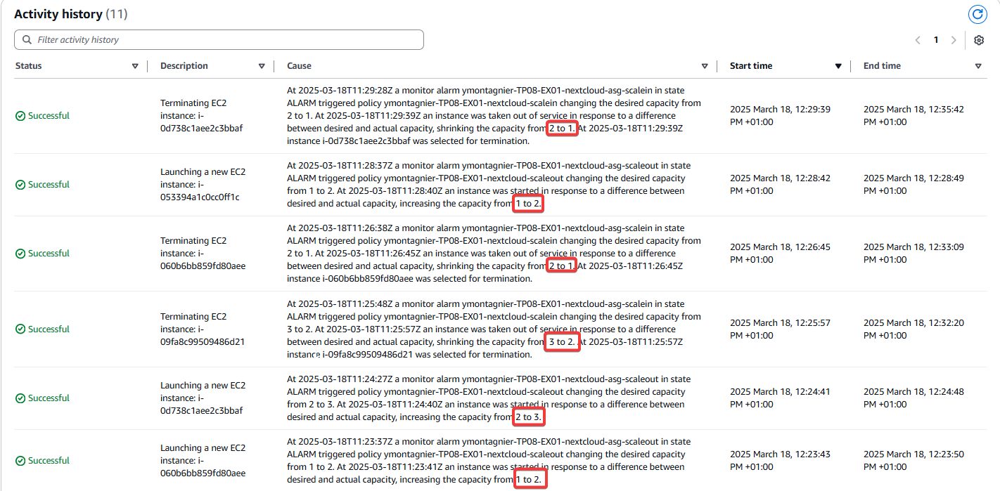
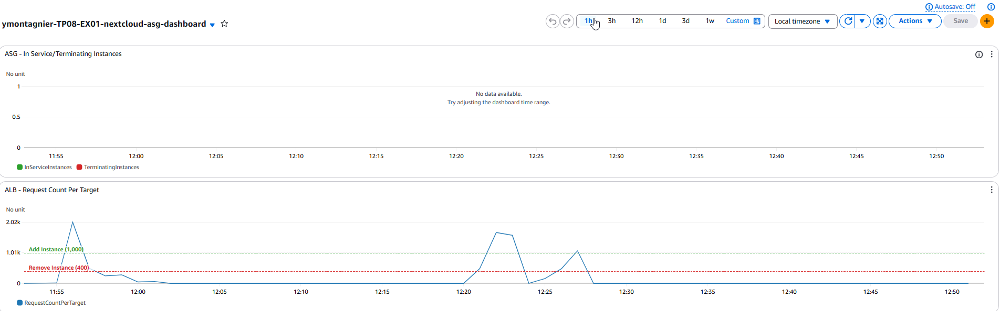

# TP8 - Exercice 1

## Contexte

Maintenant que l'Auto Scaling Group est en place, l'équipe de direction souhaite qu'il soit amélioré en mettant en place une scaling policy pour gérer automatiquement la capacité en fonction de la charge.

L'équipe d'infrastructure a réalisé un test de montée en charge minimaliste consistant à envoyer des requêtes HTTP sur la page d'authentification de Nextcloud.

Ce test a mis en lumière que l'application pouvait répondre à une volumétrie d'environ 1500 requêtes cumulées sur 1 minute; au delà, le serveur web est saturé et n'est plus en mesure de répondre correctement.

## Objectifs

Votre objectif est de mettre en place une scaling policy pour l'Auto Scaling Group afin de gérer automatiquement la capacité en fonction de la charge du serveur web en vous basant sur les résultats du test de montée en charge.

Vous devez mettre en place une scaling policy qui permettra :

* d'ajouter des instances si la charge dépasse 70% de la capacité du serveur web (1000 requêtes sur 1 minute)
* de supprimer des instances si la charge est inférieure à 30% de la capacité du serveur web (400 requêtes sur 1 minute)

## Étapes de réalisation

### 1. Création de la scaling policy

Créez deux auto scaling policies pour l'Auto Scaling Group :

* La première doit servir à ajouter une instance au groupe d'auto scaling et se nommer `<user>-<tpdir>-nextcloud-scaleout`.
* La seconde doit servir à supprimer une instance du groupe d'auto scaling et se nommer `<user>-<tpdir>-nextcloud-scalein`.
* Les deux policies doivent être :
  * De type "SimpleScaling"
  * Avoir un type d'ajustement "ChangeInCapacity" qui ajoute ou supprime une instance à la fois.

Exemple de configuration Terraform pour les policies :

```terraform
resource "aws_autoscaling_policy" "scale_out" {
  name                   = "${local.name}-nextcloud-scaleout"
  scaling_adjustment     = 1
  adjustment_type        = "ChangeInCapacity"
  policy_type            = "SimpleScaling"
  cooldown               = 300
  autoscaling_group_name = aws_autoscaling_group.nextcloud.name
}

resource "aws_autoscaling_policy" "scale_in" {
  name                   = "${local.name}-nextcloud-scalein"
  scaling_adjustment     = -1
  adjustment_type        = "ChangeInCapacity"
  policy_type            = "SimpleScaling"
  cooldown               = 300
  autoscaling_group_name = aws_autoscaling_group.nextcloud.name
}
```

### 2. Création des alarmes CloudWatch

Créez deux alarmes CloudWatch qui surveilleront le nombre de requêtes par serveur sur 1 minute.

* La première alarme doit se déclencher si le nombre de requêtes par serveur sur 1 minute est supérieur à 1000 et doit être nommée `<user>-<tpdir>-nextcloud-asg-scaleout`.
* La seconde alarme doit se déclencher si le nombre de requêtes par serveur sur 1 minute est inférieur à 400 et doit être nommée `<user>-<tpdir>-nextcloud-asg-scalein`.

> Les deux alarmes doivent être configurées pour déclencher les scaling policies correspondantes.

Exemple de configuration Terraform pour les alarmes :

```terraform
resource "aws_cloudwatch_metric_alarm" "scale_out" {
  alarm_name          = "${local.name}-nextcloud-asg-scaleout"
  comparison_operator = "GreaterThanOrEqualToThreshold"
  evaluation_periods  = 1
  metric_name         = "RequestCountPerTarget"
  namespace           = "AWS/ApplicationELB"
  period              = 60
  statistic           = "Sum"
  threshold           = 1000
  alarm_actions       = [aws_autoscaling_policy.scale_out.arn]

  dimensions = {
    TargetGroup = aws_lb_target_group.nextcloud.arn_suffix
  }
}

resource "aws_cloudwatch_metric_alarm" "scale_in" {
  alarm_name          = "${local.name}-nextcloud-asg-scalein"
  comparison_operator = "LessThanOrEqualToThreshold"
  evaluation_periods  = 1
  metric_name         = "RequestCountPerTarget"
  namespace           = "AWS/ApplicationELB"
  period              = 60
  statistic           = "Sum"
  threshold           = 400
  alarm_actions       = [aws_autoscaling_policy.scale_in.arn]

  dimensions = {
    TargetGroup = aws_lb_target_group.nextcloud.arn_suffix
  }
}
```

### 3. Création d'un dashboard CloudWatch

L'équipe DevOPS a déjà créé un dashboard CloudWatch qui affiche les métriques suivantes :

* Le nombre de requêtes par serveur sur 1 minute
* Le nombre d'instances en cours d'exécution et en cours suppression.

Le code fourni pour le dashboard est correct et n'a pas besoin de modifications.

```
resource "aws_cloudwatch_dashboard" "nextcloud" {
  dashboard_name = "${local.name}-nextcloud-asg"
  dashboard_body = jsonencode(
    {
      periodOverride = "inherit"
      start          = "-PT30M"
      widgets = [
        {
          height = 6
          properties = {
            legend = {
              position = "bottom"
            }
            liveData = true
            metrics = [
              [
                "AWS/AutoScaling",
                "GroupInServiceInstances",
                "AutoScalingGroupName",
                aws_autoscaling_group.nextcloud.name,
                {
                  color = "#2ca02c"
                  label = "InServiceInstances"
                },
              ],
              [
                ".",
                "GroupTerminatingInstances",
                ".",
                ".",
                {
                  color = "#d62728"
                  label = "TerminatingInstances"
                },
              ],
            ]
            period = 60
            region = "eu-north-1"
            stat   = "Average"
            title  = "ASG - In Service/Terminating Instances"
          }
          type  = "metric"
          width = 24
          x     = 0
          y     = 0
        },
        {
          height = 6
          properties = {
            annotations = {
              horizontal = [
                {
                  color = "#2ca02c"
                  label = "Add Instance"
                  value = 1000
                },
                {
                  color = "#d62728"
                  label = "Remove Instance"
                  value = 400
                },
              ]
            }
            legend = {
              position = "bottom"
            }
            metrics = [
              [
                "AWS/ApplicationELB",
                "RequestCountPerTarget",
                "TargetGroup",
                aws_lb_target_group.nextcloud.arn_suffix,
              ],
            ]
            period = 60
            region = "eu-north-1"
            stat   = "Sum"
            title  = "ALB - Request Count Per Target"
          }
          type  = "metric"
          width = 24
          x     = 0
          y     = 6
        },
      ]
    }
  )
}
```

### 4. Test de la scaling policy

Une fois que les scaling policies et les alarmes sont en place, effectuez un test de montée en charge pour vérifier que les instances sont bien ajoutées ou supprimées en fonction de la charge.

Utilisez l'outil siege pour effectuer ce test depuis votre instance cloud9 :

#### Installation de siege

```bash
curl -C - -O https://download.joedog.org/siege/siege-4.1.7.tar.gz && tar -xvzf siege-4.1.7.tar.gz
pushd siege-4.1.7/
./configure
make && sudo make install
popd
rm -rf siege-*
```

#### Utilisation de siege

Lancez la commande :

```bash
siege -c 5 -t 10M http://nextcloud-ymontagnier.training.akiros.it/index.php/login
```

Cette commande simule les requêtes de 5 utilisateurs qui consultent notre site en permanence pendant 10 minutes.

Pendant que la commande s'exécute, surveillez le Dashboard Cloudwatch et les alarmes dans la console AWS.

### 5. Analyse des résultats

On modifie l'ASG pour pouvoir monter jusqu'à 5 instances :

```
# Cette ressource définit un Auto Scaling Group (ASG) qui utilise le Launch Template précédemment créé dans sa version la plus récente
resource "aws_autoscaling_group" "nextcloud" {
  name                = "${local.name}-nextcloud-asg"
  desired_capacity    = 1                                    # Nombre d'instances souhaité
  min_size            = 1                                    # Nombre minimum d'instances
  max_size            = 5                                    # Nombre maximum d'instances

```

Après le test de montée en charge, les instances ont bien été ajoutées ou supprimées en fonction de la charge.



On voit bien sur le dashboard global la montée en charge et la descente :



## Livrables attendus

- Le code Terraform de l'infrastructure complété avec les configurations des scaling policies et des alarmes CloudWatch.
- Un rapport d'analyse des résultats du test de montée en charge, avec des captures d'écran du dashboard CloudWatch.

## Critères de validation

- Les scaling policies et les alarmes CloudWatch sont correctement configurées (3 points)
- Le rapport d'analyse des résultats est correct et démontre que les instances sont bien ajoutées ou supprimées en fonction de la charge (2 points)
